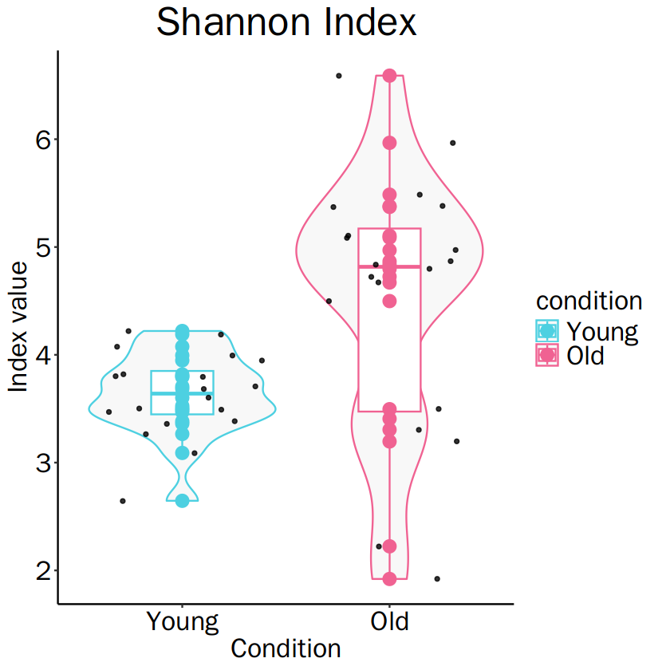
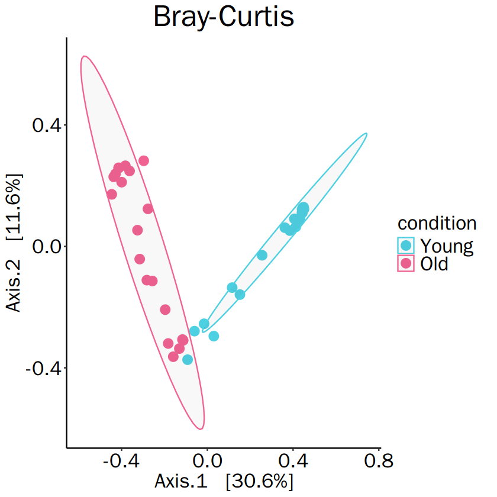
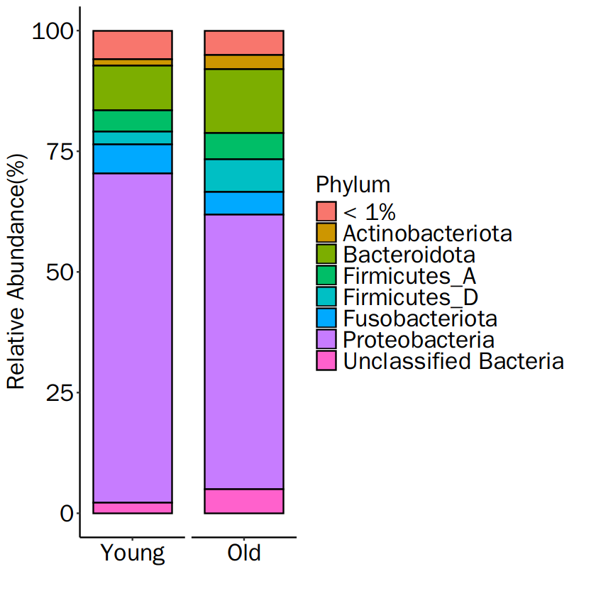
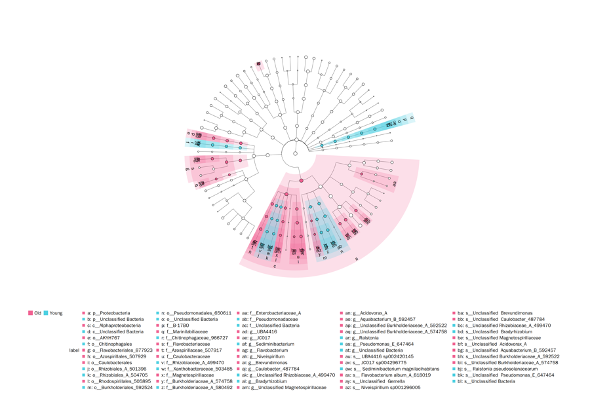

<p align="center">
  
</p>

# MicroVAR

<!-- badges: start -->
<!-- badges: end -->

The MicroVAR is Microbiome Visualization and Analysis in R 

It integrates 16S rRNA data and shotgun metagenomics data using Phyloseq, generating diversity plots and taxonomy plots to visualize sample diversity and composition. Differential abundance analysis identifies significant microbial differences between groups, and microbial interaction networks are analyzed to understand the relationships between different taxa. Additionally, functional profiling with Picrust2, including KEGG annotation and pathway analysis, is performed and visualized.

- Alpha diversity measures the variety of species within a single sample. It tells us how many different species are present and how evenly they are distributed.
- Beta diversity compares the differences in species between different samples. It shows how unique or similar the species are across various environments.
- Taxonomy analysis identifies and classifies the species in a sample based on their genetic material. It helps determine which organisms are present and their abundance.
- Differential abundance analysis identifies which species or genes are present in different amounts between groups of samples. It helps in understanding how microbial communities change in response to different conditions or treatments.
- Microbial interaction networks map the relationships and interactions between different microbial species within a community. These networks reveal how species influence each other, which can help in understanding ecosystem stability and dynamics.
- Functional profiling assesses the functional capabilities of a microbial community by identifying the genes or pathways present. It provides insights into the metabolic activities and potential functions of the community, such as nutrient cycling or disease associations.

<p align="center">

</p>

## Tools Comparison
<p align="center">
  
</p>

## Learn more
* [This tutorial](https://erasmuslab.github.io/MicroVAR/Tutorial.html) provides more detailed example analyses.

* We conducted analyses using some of the raw data from the paper by [Carda-Diéguez, M., Moazzez, R. & Mira, A. Functional changes in the oral microbiome after use of fluoride and arginine containing dentifrices: a metagenomic and metatranscriptomic study. Microbiome 10, 159 (2022).](https://doi.org/10.1186/s40168-022-01338-4) 

* We conducted analyses using some of the amplicon raw data from the paper by [Zhang Z, Feng Q, Li M, Li Z, Xu Q, Pan X and Chen W (2022) Age-Related Cancer-Associated Microbiota Potentially Promotes Oral Squamous Cell Cancer Tumorigenesis by Distinct Mechanisms. Front. Microbiol. 13:852566.](https://doi.org/10.3389/fmicb.2022.852566). This is the data for the README page.

* The raw data was downloaded from [this BioProject.](https://www.ncbi.nlm.nih.gov/bioproject/PRJNA712952/)
and [this BioProject](https://www.ncbi.nlm.nih.gov/bioproject/PRJNA803155/)


* The preprocessed data used in the example can be downloaded from the link below. If you install a package, you can also load data from within the package.
  - Download the amplicon metadata from [here.](https://github.com/ERASMUSlab/MicroVAR/blob/master/SampleData/AmpliconMetadata.csv)
  - Download the amplicon ASV data from [here.](https://github.com/ERASMUSlab/MicroVAR/blob/master/SampleData/AmpliconASV.tsv)
  - Download the amplicon taxanomy data from [here.](https://github.com/ERASMUSlab/MicroVAR/blob/master/SampleData/AmpliconTaxonomy.tsv)
  - Download the amplicon tree data from [here.](https://github.com/ERASMUSlab/MicroVAR/blob/master/SampleData/AmpliconRootedTree.nwk)
  - Download the amplicon Picrust2 data from [here.](https://github.com/ERASMUSlab/MicroVAR/blob/master/SampleData/AmpliconPicrust.tsv)
  - Download the shotgun metadata from [here.](https://github.com/ERASMUSlab/MicroVAR/blob/master/SampleData/ShotgunMetadata.csv)
  - Download the shotgun biom data from [here.](https://github.com/ERASMUSlab/MicroVAR/blob/master/SampleData/ShotgunBiomData.biom)

## Installation
You can install the development version of MicroVAR from [GitHub](https://github.com/) with:

``` r
# install.packages("devtools")
devtools::install_github("ERASMUSlab/MicroVAR")
```

## Raw Data Preprocessing
We utilized the following packages to preprocess the raw data. 
* Qiime2-2023.07
* Pircurst2 

```bash
qiime tools import \
qiime demux summarize \
qiime dada2 denoise-paired
qiime feature-classifier classify-sklearn
picrust2_pipeline.py
```
* Trim Galore
* Bowtie2
* Samtools
* Kraken2
* Bracken  

## Example analyses
``` r
library(MicroVAR)
```

### Creating Phyloseq Data
``` r
ps <- createAmpPhylo(metadata_path = "AmpliconMetadata.csv",
                     asv_path = "AmpliconASV.tsv", 
                     taxa_path = "AmpliconTaxonomy.tsv", 
                     tree_path = "AmpliconRootedTree.nwk")
                     
ps <- createShotPhylo(metadata_path = "ShotgunMetadata.csv"
                      biom_path = "ShotgunBiomData.biom")
```

### Creating Alpha Diversity Plot
```r
p <- plotAlphaDiversity(phyloseq = ps, 
                        condition_col = "condition", 
                        condition_label = c("Young","Old"), 
                        colors = c('#4DD0E1','#F06292'), 
                        measure = "Shannon",
                        text_size = 20)
p
```


### Creating Beta Diversity Plot
```r
#Example
p <- plotBetaDiversity(phyloseq = ps, 
                       condition_col = "condition", 
                       condition_label = c("Young","Old"), 
                       colors = c('#4DD0E1','#F06292'), 
                       measure = "bray",
                       text_size = 20)
p
```


### Creating Taxonomy Plot
```r
p <- plotTaxonomyBars(phyloseq = ps, 
                      condition_label = c("Young","Old"), 
                      taxa_level = "Phylum", 
                      keep_percent = 1)
p
```



### Creating HeatTree Plot
```r
p <- plotHeatTree(phyloseq = ps,
                  taxa_p = 0.1,
                  seed = 0,
                  p_adjust = "BH", 
                  group ="condition",
                  condition_label = c("Young", "Old"), 
                  pvalue_cutoff = 0.05, 
                  norm = "CLR",
                  clade_label_level = 7,
                  lade_label_font_size = 6, 
                  colors = c('#4DD0E1','#F06292'), 
                  text_size = 17)
p
```



